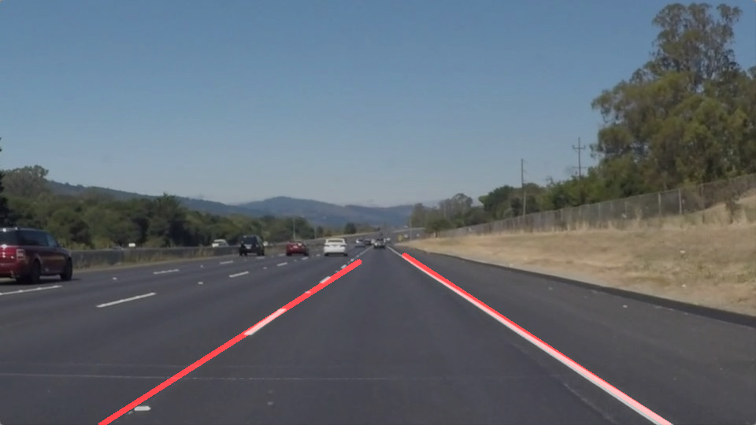
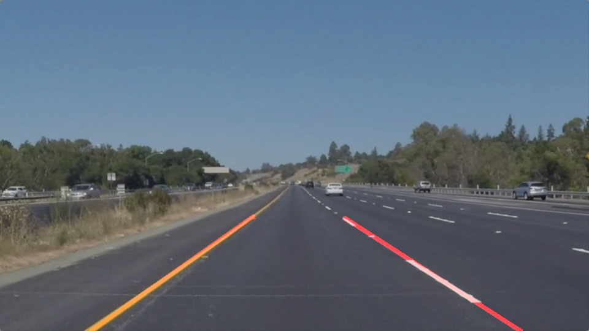
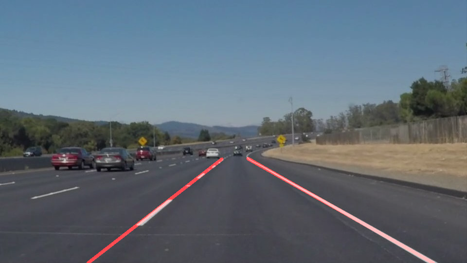
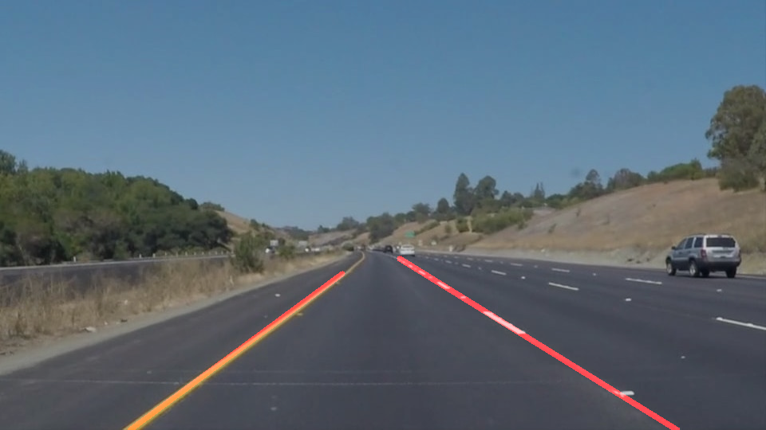
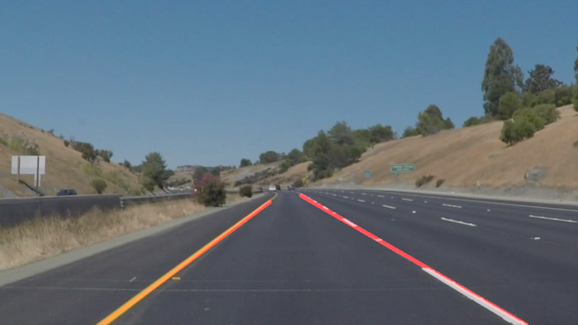
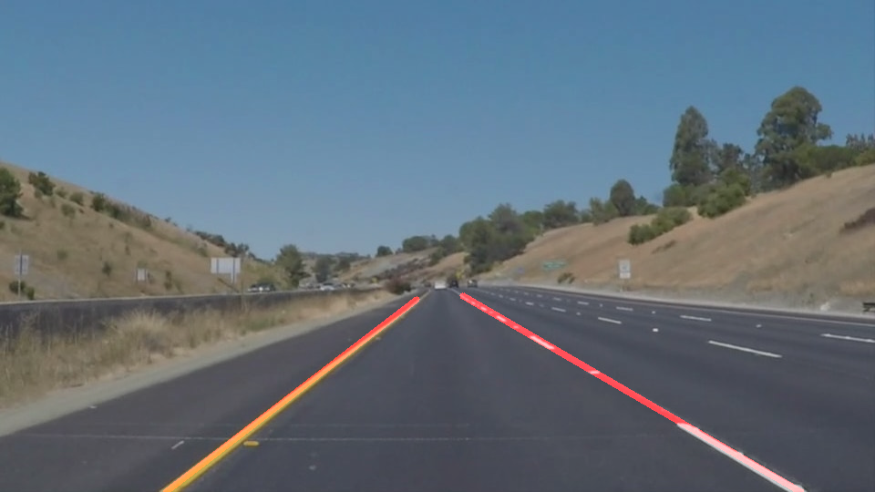

# **Finding Lane Lines on the Road** 

---

**Finding Lane Lines on the Road**

The goals / steps of this project are:
* Make a pipeline that finds lane lines on the road
* Reflect on your work in a written report

---

### Reflection

### 1. Pipeline Description.

My pipeline consisted of 5 steps. First, I converted the images to grayscale, then I .... 

In order to draw a single line on the left and right lanes, I modified the draw_lines() function by ...

Following are the required test output images, with lane lines overlayed: 

solidWhiteRight.jpg:

solidYellowLeft.jpg:

solidWhiteCurve.jpg:

solidYellowCurve.jpg:

solidYellowCurve2.jpg:

whiteCarLaneSwitch.jpg:

### 2. Identify potential shortcomings with your current pipeline

One potential shortcoming would be what would happen when ... 

Another shortcoming could be ...

### 3. Suggest possible improvements to your pipeline

A possible improvement would be to ...

Another potential improvement could be to ...
